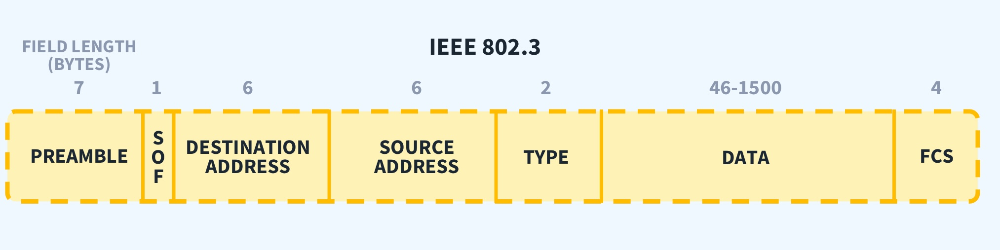

# Raw Ethernet packet receiver 

## Description

Cross-platform, simple CLI util, written in Rust, to receive raw 802.3 packets and filter them by EtherType. The optimal solution is to use eBPF loading the VM with a specific compiled filter, but that is fully compatible with Linux, only.

Useful when building sensor-streaming applications with embedded devices, to receive the constant data flow from the device and process it in real-time.

Note: execution requires root privileges.

## Ethernet frame breakdown

